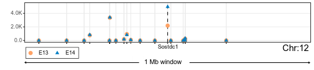

<!-- README.md is generated from README.Rmd. Please edit that file -->

```{r, include = FALSE}
knitr::opts_chunk$set(
  collapse = TRUE,
  comment = "#>",
  fig.path = "man/figures/README-",
  out.width = "100%"
)
```

# DELocal

### Citation: 
Das Roy R, Hallikas O, Christensen MM, Renvoisé E, Jernvall J (2021) Chromosomal neighbourhoods allow identification of organ specific changes in gene expression. PLoS Comput Biol 17(9): e1008947. https://doi.org/10.1371/journal.pcbi.1008947

<!-- badges: start -->
<!-- badges: end -->

The goal of [DELocal](https://doi.org/10.1371/journal.pcbi.1008947) is to identify DE genes compared to their neighboring genes from chromosomal location.


In the above figure it can be seen that **Sostdc1** is differentially expressed in developing tooth tissues (E13 and E14). __DELocal__ helps in identifying similar genes.

## Installation

You can install the released version of DELocal with:

``` r
if (!requireNamespace("devtools")) {
  install.packages("devtools")
}
devtools::install_github("dasroy/delocal")
```

## How to run

This is a basic example which shows you how to use __DELocal__:

First a **SummarizedExperiment** object will be configured with gene expression count matrix and gene location info.

### Read the raw count values  

```{r example,message=FALSE,warning=FALSE}
library(DELocal)
count_matrix <- as.matrix(read.table(file = system.file("extdata", 
                                              "tooth_RNASeq_counts.txt", 
                                              package = "DELocal")))
colData <- data.frame(condition=gsub("\\..*",x=colnames(count_matrix),replacement = ""))
```

### Getting gene chromosomal location  

Example of required gene location information  

```{r message=FALSE,warning=FALSE}
gene_location <- read.table(file = system.file("extdata", 
                                              "gene_location.txt", 
                                              package = "DELocal"))
head(gene_location)
```


### Example code to get gene location information like above

```{r eval=FALSE}
require(biomaRt)
gene_attributes<- c("ensembl_gene_id", "start_position", "chromosome_name")
ensembl_ms_mart <- useMart(biomart="ENSEMBL_MART_ENSEMBL",
                           dataset="mmusculus_gene_ensembl", host="www.ensembl.org")
gene_location_sample <- getBM(attributes=gene_attributes, mart=ensembl_ms_mart,
                       verbose = FALSE)
rownames(gene_location_sample) <- gene_location_sample$ensembl_gene_id
```


### Integrating gene expression and location into a single object.

```{r message=FALSE,warning=FALSE,error=FALSE}
smrExpt <- SummarizedExperiment::SummarizedExperiment(assays=list(counts=count_matrix),
                                                      rowData = gene_location, 
                                                      colData=colData)
smrExpt
```

## Final results        

These may take long time to run the whole data therefore here we will analyse genes only from X chromosome.  

```{r message=FALSE,warning=FALSE,error=FALSE}
contrast= c("condition","ME13","ME14")

require(dplyr)
x_genes <- SummarizedExperiment::rowData(smrExpt) %>% 
    as.data.frame() %>% 
    filter(chromosome_name=="X") %>% rownames() 

DELocal_result <- DELocal(smrExpt = smrExpt[x_genes,], contrast = contrast,
                         nearest_neighbours = 5,pDesign = ~ condition,
                         pValue_cut = 0.05, logFold_cut = 0)

```


### Dynamic neighbour

Here TAD domain boundaries will be used as dynamic boundaries

``` r
TADKB <- readRDS("../DELocal_manuscript/markdowns/Mouse_TAD_boundaries.rds")
gene_location_dynamicNeighbourhood <- TADKB %>% dplyr::select(ensembl_gene_id, start_position, chromosome_name,startTAD   ,endTAD) %>% unique()
rownames(gene_location_dynamicNeighbourhood) <- gene_location_dynamicNeighbourhood$ensembl_gene_id

# rename the columns as required by DELocal
colnames(gene_location_dynamicNeighbourhood)[4:5] <- c("neighbors_start","neighbors_end")

smrExpt_dynamicNeighbour <-
    SummarizedExperiment::SummarizedExperiment(
        assays = list(counts = count_matrix),
        rowData = gene_location_dynamicNeighbourhood[rownames(count_matrix), ],
        colData = colData
    )
                                                      
one_genes <- SummarizedExperiment::rowData(smrExpt_dynamicNeighbour) %>% 
    as.data.frame() %>% 
    filter(chromosome_name=="1") %>% rownames() 

DELocal_result <- DELocal(smrExpt = smrExpt_dynamicNeighbour[one_genes,], contrast = contrast,
                         nearest_neighbours = 5,pDesign = ~ condition,
                         pValue_cut = 0.05, logFold_cut = 0)
```

