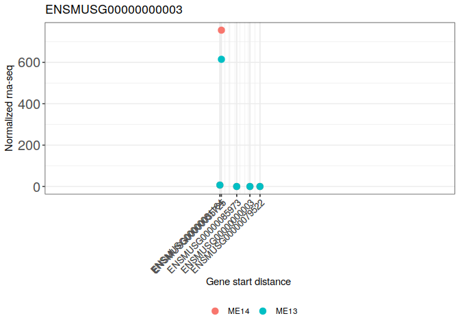

<!-- README.md is generated from README.Rmd. Please edit that file -->

# DELocal

### Citation:

Das Roy R, Hallikas O, Christensen MM, Renvoisé E, Jernvall J (2021)
Chromosomal neighbourhoods allow identification of organ specific
changes in gene expression. PLoS Comput Biol 17(9): e1008947.
<https://doi.org/10.1371/journal.pcbi.1008947>

<!-- badges: start -->

<!-- badges: end -->

The goal of [DELocal](https://doi.org/10.1371/journal.pcbi.1008947) is
to identify DE genes compared to their neighboring genes from
chromosomal location.

   
In the above figure it can be seen that **Sostdc1**
is differentially expressed in developing tooth tissues (E13 and E14).
**DELocal** helps in identifying similar genes.

## Installation

You can install the released version of DELocal with:

``` r
if (!requireNamespace("devtools")) {
  install.packages("devtools")
}
devtools::install_github("dasroy/delocal")
```

## How to run

This is a basic example which shows you how to use **DELocal**:

First a **SummarizedExperiment** object will be configured with gene
expression count matrix and gene location info.

### Read the raw count values

``` r
library(DELocal)
count_matrix <- as.matrix(read.table(file = system.file("extdata", 
                                              "tooth_RNASeq_counts.txt", 
                                              package = "DELocal")))
colData <- data.frame(condition=gsub("\\..*",x=colnames(count_matrix),replacement = ""),pair_id = rep(1:7,2))
```

### Getting gene chromosomal location

Example of required gene location information

``` r
gene_location <- read.table(file = system.file("extdata", 
                                              "gene_location.txt", 
                                              package = "DELocal"))
head(gene_location)
#>                       ensembl_gene_id start_position chromosome_name
#> ENSMUSG00000000001 ENSMUSG00000000001      108107280               3
#> ENSMUSG00000000003 ENSMUSG00000000003       77837901               X
#> ENSMUSG00000000028 ENSMUSG00000000028       18780447              16
#> ENSMUSG00000000031 ENSMUSG00000000031      142575529               7
#> ENSMUSG00000000037 ENSMUSG00000000037      161082525               X
#> ENSMUSG00000000049 ENSMUSG00000000049      108343354              11
```

### Example code to get gene location information like above

``` r
require(biomaRt)
gene_attributes<- c("ensembl_gene_id", "start_position", "chromosome_name")
ensembl_ms_mart <- useMart(biomart="ENSEMBL_MART_ENSEMBL",
                           dataset="mmusculus_gene_ensembl", host="www.ensembl.org")
gene_location_sample <- getBM(attributes=gene_attributes, mart=ensembl_ms_mart,
                       verbose = FALSE)
rownames(gene_location_sample) <- gene_location_sample$ensembl_gene_id
```

### Integrating gene expression and location into a single object.

``` r
smrExpt <- SummarizedExperiment::SummarizedExperiment(assays=list(counts=count_matrix),
                                                      rowData = gene_location[rownames(count_matrix),], 
                                                      colData=colData)
## Note:: The order of rowData should be same as count_matrix
smrExpt
#> class: SummarizedExperiment 
#> dim: 52183 14 
#> metadata(0):
#> assays(1): counts
#> rownames(52183): ENSMUSG00000000001 ENSMUSG00000000003 ...
#>   ENSMUSG00000114967 ENSMUSG00000114968
#> rowData names(3): ensembl_gene_id start_position chromosome_name
#> colnames(14): ME14.E1M1R ME14.E2M1R ... ME13.E9M1R ME13.EXM1L
#> colData names(2): condition pair_id
```

### Plot neighbourhood

Here we plot neighbourhood of **Sostdc1** and get data of its
neighbouring genes.

``` r
results <- plotNeighbourhood(pSmrExpt = smrExpt,pNearest_neighbours = 5,pDesign = ~ condition,
                  colorFactor = "condition",pGene_id = "ENSMUSG00000000003")
```



## Final results

These may take long time to run the whole data therefore here we will
analyse genes only from X chromosome.

``` r
contrast= c("condition","ME13","ME14")

require(dplyr)
x_genes <- SummarizedExperiment::rowData(smrExpt) %>% 
     subset(subset=chromosome_name=="X") %>% rownames() 

DELocal_result <- DELocal(pSmrExpt = smrExpt[x_genes,], nearest_neighbours = 5,
                          pDesign = ~ condition,
                         pValue_cut = 0.05,pLogFold_cut = 0)
#> [1] "Default 1Mb neighborhood will be used"
```

### Dynamic neighbour

Here TAD domain boundaries will be used as dynamic boundaries

``` r
TADKB <- readRDS("../DELocal_manuscript/markdowns/Mouse_TAD_boundaries.rds")
gene_location_dynamicNeighbourhood <- TADKB %>% dplyr::select(ensembl_gene_id, start_position, chromosome_name,startTAD   ,endTAD) %>% unique()
rownames(gene_location_dynamicNeighbourhood) <- gene_location_dynamicNeighbourhood$ensembl_gene_id

# rename the columns as required by DELocal
colnames(gene_location_dynamicNeighbourhood)[4:5] <- c("neighbors_start","neighbors_end")

smrExpt_dynamicNeighbour <-
    SummarizedExperiment::SummarizedExperiment(
        assays = list(counts = count_matrix),
        rowData = gene_location_dynamicNeighbourhood[rownames(count_matrix), ],
        colData = colData
    )
                                                      
one_genes <- SummarizedExperiment::rowData(smrExpt_dynamicNeighbour) %>% 
    as.data.frame() %>% 
    filter(chromosome_name=="1") %>% rownames() 

DELocal_result <- DELocal(smrExpt = smrExpt_dynamicNeighbour[one_genes,], contrast = contrast,
                         nearest_neighbours = 5,pDesign = ~ condition,
                         pValue_cut = 0.05, logFold_cut = 0)
```

``` r
sessionInfo()
#> R version 4.0.3 (2020-10-10)
#> Platform: x86_64-pc-linux-gnu (64-bit)
#> Running under: Ubuntu 18.04.6 LTS
#> 
#> Matrix products: default
#> BLAS:   /usr/lib/x86_64-linux-gnu/openblas/libblas.so.3
#> LAPACK: /usr/lib/x86_64-linux-gnu/libopenblasp-r0.2.20.so
#> 
#> locale:
#>  [1] LC_CTYPE=en_GB.UTF-8       LC_NUMERIC=C              
#>  [3] LC_TIME=en_GB.UTF-8        LC_COLLATE=en_GB.UTF-8    
#>  [5] LC_MONETARY=en_GB.UTF-8    LC_MESSAGES=en_GB.UTF-8   
#>  [7] LC_PAPER=en_GB.UTF-8       LC_NAME=C                 
#>  [9] LC_ADDRESS=C               LC_TELEPHONE=C            
#> [11] LC_MEASUREMENT=en_GB.UTF-8 LC_IDENTIFICATION=C       
#> 
#> attached base packages:
#> [1] stats     graphics  grDevices utils     datasets  methods   base     
#> 
#> other attached packages:
#> [1] gtools_3.8.2     dplyr_1.0.2      ggplot2_3.3.2    DELocal_0.0.1.01
#> 
#> loaded via a namespace (and not attached):
#>  [1] locfit_1.5-9.4              Rcpp_1.0.5                 
#>  [3] lattice_0.20-45             digest_0.6.25              
#>  [5] plyr_1.8.6                  R6_2.4.1                   
#>  [7] GenomeInfoDb_1.24.2         stats4_4.0.3               
#>  [9] RSQLite_2.2.1               evaluate_0.14              
#> [11] highr_0.8                   pillar_1.4.6               
#> [13] zlibbioc_1.34.0             rlang_0.4.10               
#> [15] annotate_1.66.0             blob_1.2.1                 
#> [17] S4Vectors_0.26.1            Matrix_1.2-18              
#> [19] rmarkdown_2.4               labeling_0.3               
#> [21] splines_4.0.3               BiocParallel_1.22.0        
#> [23] geneplotter_1.66.0          stringr_1.4.0              
#> [25] RCurl_1.98-1.2              bit_4.0.4                  
#> [27] munsell_0.5.0               DelayedArray_0.14.1        
#> [29] compiler_4.0.3              xfun_0.22                  
#> [31] pkgconfig_2.0.3             BiocGenerics_0.34.0        
#> [33] htmltools_0.5.1.1           tidyselect_1.1.0           
#> [35] SummarizedExperiment_1.18.2 tibble_3.0.4               
#> [37] GenomeInfoDbData_1.2.3      IRanges_2.22.2             
#> [39] matrixStats_0.57.0          XML_3.99-0.5               
#> [41] crayon_1.3.4                withr_2.4.2                
#> [43] bitops_1.0-6                grid_4.0.3                 
#> [45] xtable_1.8-4                gtable_0.3.0               
#> [47] lifecycle_1.0.0             DBI_1.1.0                  
#> [49] magrittr_2.0.1              scales_1.1.1               
#> [51] stringi_1.5.3               cachem_1.0.4               
#> [53] farver_2.0.3                reshape2_1.4.4             
#> [55] XVector_0.28.0              genefilter_1.70.0          
#> [57] limma_3.44.3                ellipsis_0.3.1             
#> [59] generics_0.0.2              vctrs_0.3.4                
#> [61] RColorBrewer_1.1-2          tools_4.0.3                
#> [63] bit64_4.0.5                 Biobase_2.48.0             
#> [65] glue_1.4.2                  DESeq2_1.28.1              
#> [67] purrr_0.3.4                 parallel_4.0.3             
#> [69] fastmap_1.0.1               survival_3.2-7             
#> [71] yaml_2.2.1                  AnnotationDbi_1.50.3       
#> [73] colorspace_1.4-1            GenomicRanges_1.40.0       
#> [75] memoise_2.0.0               knitr_1.31
```
