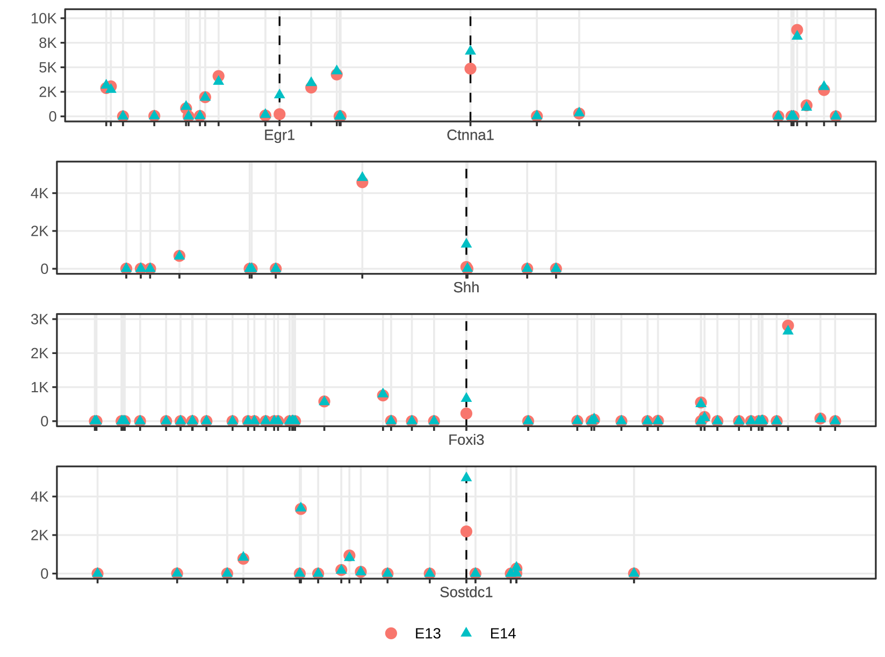

<!-- README.md is generated from README.Rmd. Please edit that file -->

# DELocal

<!-- badges: start -->

<!-- badges: end -->

The goal of DELocal is to …



## Installation

You can install the released version of DELocal with:

``` r
devtools::install_github("dasroy/delocal")
```

## Example

This is a basic example which shows you how to solve a common problem:

``` r
library(DELocal)

## basic example code
count_matrix <- as.matrix(read.table(file = system.file("extdata", 
                                              "tooth_RNASeq_counts.txt", 
                                              package = "DELocal")))
colData <- data.frame(condition=gsub("\\..*",x=colnames(count_matrix),replacement = ""))

library(DESeq2)
dds <- DESeqDataSetFromMatrix(countData = count_matrix,
                              colData = colData,
                              design = ~ condition)

dds
#> class: DESeqDataSet 
#> dim: 52183 14 
#> metadata(1): version
#> assays(1): counts
#> rownames(52183): ENSMUSG00000000001 ENSMUSG00000000003 ...
#>   ENSMUSG00000114967 ENSMUSG00000114968
#> rowData names(0):
#> colnames(14): ME14.E1M1R ME14.E2M1R ... ME13.E9M1R ME13.EXM1L
#> colData names(1): condition
ddsHTSeq_count<-DESeq2::estimateSizeFactors(dds)
ddsHTSeq_count<-as.data.frame( DESeq2::counts(ddsHTSeq_count,normalized=TRUE))

ddsHTSeq_count$ensembl_gene_id <- rownames(ddsHTSeq_count)
```

## Getting gene chromosomal location

``` r
gene_location <- read.table(file = system.file("extdata", 
                                              "gene_location.txt", 
                                              package = "DELocal"))
DT::datatable(gene_location[,c("ensembl_gene_id","start_position","chromosome_name")],
              rownames = FALSE)
```


``` r

###
# Example code to generate above table
###
# require(biomaRt)
# gene_attributes<- c("ensembl_gene_id",  "external_gene_name", "start_position", 
#                     "end_position", "chromosome_name", "gene_biotype")
# ensembl_ms_mart <- useMart(biomart="ENSEMBL_MART_ENSEMBL", 
#                            dataset="mmusculus_gene_ensembl", host="www.ensembl.org")
# gene_location <- getBM(attributes=gene_attributes, mart=ensembl_ms_mart,  
#                        verbose = FALSE)
# rownames(gene_location) <- gene_location$ensembl_gene_id
```

``` r
smrExpt <- SummarizedExperiment(assays=list(counts=count_matrix),
                     rowData = gene_location, colData=colData)

contrast= c("condition","ME13","ME14")

DELocal_result <- DELocal(smrExpt = smrExpt, contrast = contrast,
                         nearest_neighbours = 5,pDesign = ~ condition,
                         pValue_cut = 0.05, logFold_cut = 0)
```
