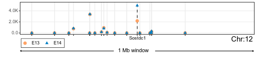

```{r, include = FALSE}
knitr::opts_chunk$set(
  collapse = TRUE,
  comment = "#>"
)
```

# DELocal

## Introduction

Exploration of genetically modified organisms, developmental processes, diseases or responses to various treatments require accurate measurement of changes in gene expression. This can be done for thousands of genes using high throughput technologies such as microarray and RNAseq. However, identification of differentially expressed (DE) genes poses technical challenges due to limited sample size, few replicates, or simply very small changes in expression levels. Consequently, several methods have been developed to determine DE genes, such as Limma, edgeR, and DESeq2. These methods identify DE genes based on the expression levels alone. As genomic co-localization of genes is generally not linked to co-expression, we deduced that DE genes could be detected with the help of genes from chromosomal neighbourhood. Here, we present a new method, [DELocal](https://doi.org/10.1371/journal.pcbi.1008947), which identifies DE genes by comparing their expression changes to changes in adjacent genes in their chromosomal regions.

\
In the above figure it can be seen that **Sostdc1** is differentially expressed in developing tooth tissues (E13 and E14). **DELocal** helps in identifying similar genes.

## Installation

```{r eval=FALSE}
if (!require("BiocManager", quietly = TRUE))
    install.packages("BiocManager")

BiocManager::install("delocal")
```

To install from github

```{r eval=FALSE}
if (!requireNamespace("devtools")) {
  install.packages("devtools")
}
devtools::install_github("dasroy/delocal")
```

## How to run

This is a basic example which shows you how to use **DELocal**:

First a **SummarizedExperiment** object will be configured with gene expression count matrix and gene location info.

#### Read the raw count values

```{r example,message=FALSE,warning=FALSE}
library(DELocal)
count_matrix <- as.matrix(read.table(file = system.file("extdata", 
                                              "tooth_RNASeq_counts.txt", 
                                              package = "DELocal")))
colData <- data.frame(condition=gsub("\\..*",x=colnames(count_matrix),
                                     replacement = ""))
```

#### Getting gene chromosomal location

Example of required gene location information

```{r message=FALSE,warning=FALSE}
gene_location <- read.table(file = system.file("extdata", 
                                              "gene_location.txt", 
                                              package = "DELocal"))
head(gene_location)
```

#### Example code to get gene location information like above

```{r eval=TRUE}
library(biomaRt)
gene_attributes <- c("ensembl_gene_id", "start_position", "chromosome_name")
ensembl_ms_mart <- useMart(biomart="ENSEMBL_MART_ENSEMBL",
                           dataset="mmusculus_gene_ensembl", host="www.ensembl.org")
gene_location_sample <- getBM(attributes=gene_attributes, mart=ensembl_ms_mart,
                       verbose = FALSE)
rownames(gene_location_sample) <- gene_location_sample$ensembl_gene_id
```

#### Integrating gene expression and location into a single object.

```{r message=FALSE,warning=FALSE,error=FALSE}
smrExpt <- SummarizedExperiment::SummarizedExperiment(assays=list(counts=count_matrix),
                                                      rowData = gene_location, 
                                                      colData=colData)
smrExpt
```

#### Final results

These may take long time to run the whole data therefore here we will analyse genes only from X chromosome. Here in this example DELocal compares each gene with 5 'nearest_neighbours' and returns only genes whose adjusted *p*-value is less than pValue_cut.

```{r message=FALSE,warning=FALSE,error=FALSE}
library(dplyr)
x_genes <- SummarizedExperiment::rowData(smrExpt) %>% 
    as.data.frame() %>% 
    filter(chromosome_name=="X") %>% rownames() 

DELocal_result <- DELocal(pSmrExpt = smrExpt[x_genes,],
                         nearest_neighbours = 5,pDesign = ~ condition,
                         pValue_cut = 0.05)

head(round(DELocal_result,digits = 9))
```

The results are already sorted in ascending order of adjusted *p*-value (adj.P.Val)

#### Plot expression pattern of a neighbourhood of a gene

plotNeighbourhood function can be used to plot median expressions of different 'condition' for a gene of interest and its pNearest_neighbours genes.

```{r message=FALSE,warning=FALSE,error=FALSE}
DELocal::plotNeighbourhood(pSmrExpt = smrExpt, pGene_id = "ENSMUSG00000059401", 
                           pNearest_neighbours=5, pDesign = ~ condition)$plot
```

#### Dynamic neighbour

Here TAD domain boundaries will be used as dynamic boundaries

```{r message=FALSE,warning=FALSE,error=FALSE}
gene_location_dynamicNeighbourhood <- read.csv(system.file("extdata", "Mouse_TAD_boundaries.csv",
                             package = "DELocal"))

rownames(gene_location_dynamicNeighbourhood) <- 
    gene_location_dynamicNeighbourhood$ensembl_gene_id

# rename the columns as required by DELocal
colnames(gene_location_dynamicNeighbourhood)[4:5] <- c("neighbors_start",
                                                       "neighbors_end")
common_genes <- intersect(rownames(count_matrix),
                          rownames(gene_location_dynamicNeighbourhood) )

smrExpt_dynamicNeighbour <-
    SummarizedExperiment::SummarizedExperiment(
        assays = list(counts = count_matrix[common_genes,]),
        rowData = gene_location_dynamicNeighbourhood[common_genes, ],
        colData = colData
    )
                                                      
one_genes <- SummarizedExperiment::rowData(smrExpt_dynamicNeighbour) %>% 
    as.data.frame() %>% 
    filter(chromosome_name=="1") %>% rownames() 

DELocal_result <- DELocal(pSmrExpt = smrExpt_dynamicNeighbour[one_genes,], 
                         nearest_neighbours = 5,pDesign = ~ condition,
                         pValue_cut = 0.05, pLogFold_cut = 0)
```

## SessionInfo

<details>

```{r echo=FALSE}
sessionInfo()
```

</details>
